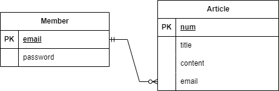

# wanted-pre-onboarding-backend

- <b>성명</b>
  : 홍성빈  
- <b>애플리케이션의 실행 방법 (엔드포인트 호출 방법 포함)</b> 
1. 회원가입 : post , /member/join
2. 로그인 : post, /member/login
3. 게시글작성 : post, /board/writeArticle
4. 게시글목록 : get, board/articleList/{page}
5. 게시글조회 : get, board/searchArticle/{num}
6. 게시글수정 : put, board/modifyArticle/{num}
7. 게시글삭제 : delete, /board/removeArticle/{num}   
- <b>데이터베이스 테이블 구조</b> 
    
- <b>구현한 API의 동작을 촬영한 데모 영상 링크</b>
   (클립챔프) https://clipchamp.com/watch/k0QBlCo98dh
   (유튜브) https://youtu.be/0g99AdosTYc  
  
- <b>구현 방법 및 이유에 대한 간략한 설명</b> 
\- springboot 사용 
\- jpa를 사용한 테이블 생성, 조작 
\- 코드의 간결성을 위해 lombok 라이브러리 사용 
\- spring security와 JWT를 통한 사용자 인증과 권한 부여 처리 
\- postman을 사용한 어플리케이션 테스트와 실행   

- <b>API 명세</b>

|method|url|설명|request|response|
|------|---|---|---|---|
|post|/member/join|회원가입|MemberDTO|String (회원가입완료안내)|
|post|/member/login|로그인|MemberDTO|TokenInfo|
|post|/board/writeArticle|게시글작성|ArticleDTO|ArticleDTO|
|get|/board/articleList/{page}|게시글목록|int reqCnt (페이지당 글 수)|List\<ArticleDTO\>|
|get|/board/searchArticle/{num}|게시글조회|int num(글번호)|ArticleDTO|
|put|/board/modifyArticle/{num}|게시글수정|int num(글번호), String content(수정내용)|ArticleDTO|
|delete|/board/removeArticle/{num}|게시글삭제|int num(글번호)|String message (삭제완료안내)|

